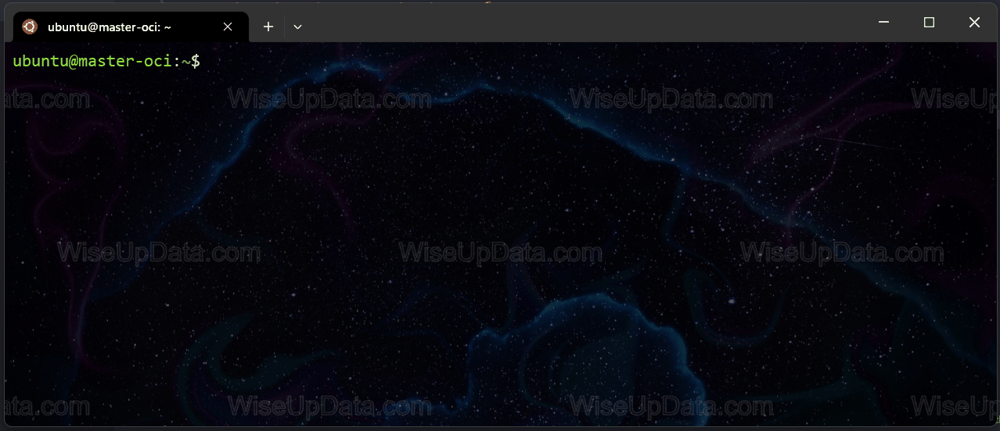
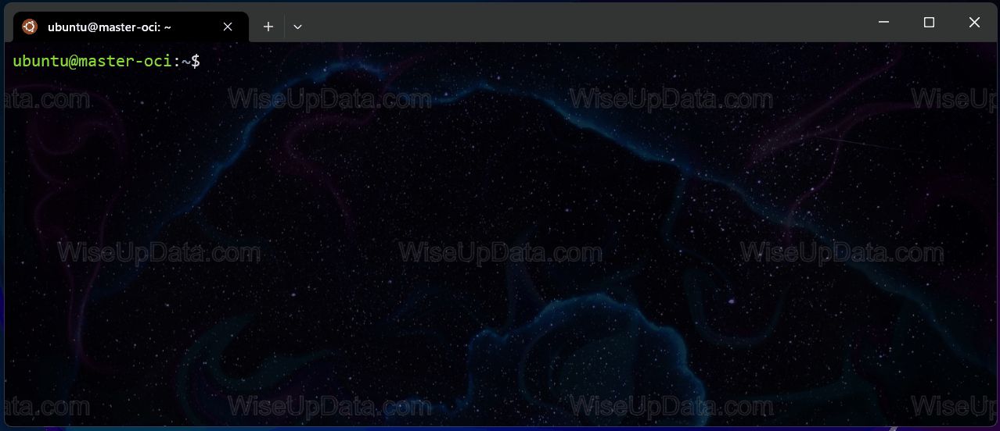
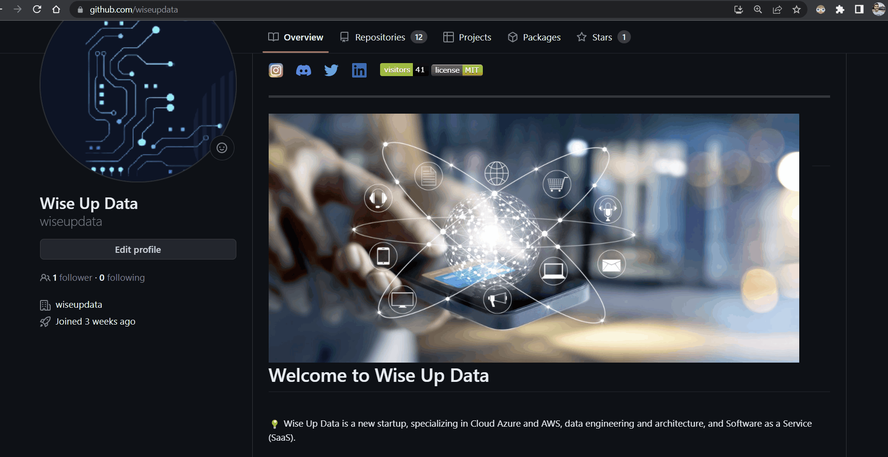
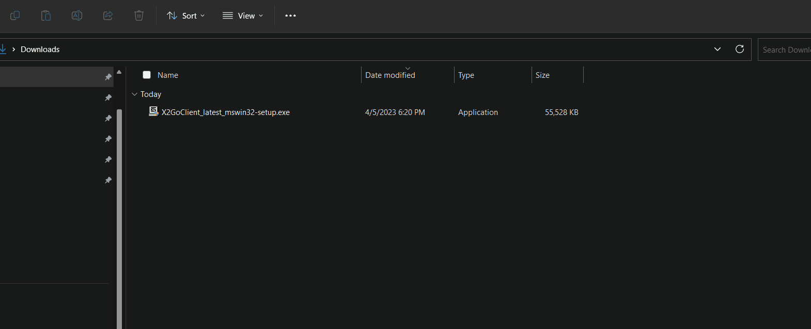
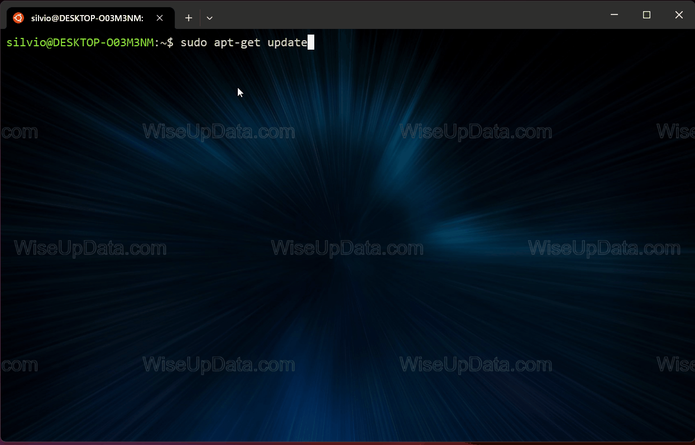

<a href="https://github.com/wiseupdata/wiseupdata">
     
</a> 
<a href="https://github.com/wiseupdata/wiseupdata">
  
</a>
<a href="https://github.com/wiseupdata/wiseupdata">
  
</a>
<a href="https://github.com/wiseupdata/wiseupdata">
  
</a>


---

<a name="readme-top"></a>

<a href="https://github.com/wiseupdata/wiseupdata">

</a>

<h1>
Shell Linux
</h1>
Util Commands | Ubuntu, Debian, Wsl2
<br>
<br>
<br>
<br>
<br>

<details>
<summary>
    Install GUI RDP, remote desktop in one VM ⏬
</summary>

<br>
<details>
<summary>
    Information 🔎
</summary>

> X2Go is a remote desktop software solution that enables you to access graphical desktops of Linux servers over a low bandwidth connection. It is a fast and lightweight alternative to other remote desktop protocols, such as VNC or RDP.
> 
> X2Go is a good choice for setting up RDP on your Ubuntu VM running in Cloud for several reasons:
> 
> - It is open-source and free.
> - It provides a secure remote desktop solution by using the SSH protocol for encryption.
> - It supports various desktop environments, such as Xfce, Mate, LXDE, KDE, and more.
> - It is easy to install and configure on Ubuntu.
> - It has a low memory footprint, making it suitable for low-spec VMs.
> 
> Overall, X2Go is a reliable and efficient option for setting up RDP on your Ubuntu VM in Cloud.

</details>


<details>
<summary>
  Installation 🧑‍💻
</summary>


### Let's update the Ubuntu system

```
sudo apt update
sudo apt upgrade
```


</img>
<br>

### Install the X2Go server

```
sudo apt install software-properties-common
sudo add-apt-repository ppa:x2go/stable
sudo apt update
sudo apt install x2goserver x2goserver-xsession
```
<a href="https://github.com/wiseupdata/wiseupdata">

</img>
</a>
<br>

### Install the xfce4 server

```
sudo apt install xfce4
```
<a href="https://github.com/wiseupdata/wiseupdata">
</img>
</a>
<br>


### You can also install the gnome

```
sudo apt-get install ubuntu-gnome-desktop
```


### Start the X2Go server

```
sudo systemctl start x2goserver
sudo service x2goserver status
```

<a href="https://github.com/wiseupdata/wiseupdata">

</a>

<br>
<br>

</details>

<details>
<summary>
  Extra - Install the X2Go Client in the Windows 11 ♨️
</summary>

### Let's download the client ✈️

[X2GoClient](https://wiki.x2go.org/doku.php/doc:installation:x2goclient)

<a href="https://github.com/wiseupdata/wiseupdata">

</img>
</a>
<br>

### Install the software


</img>
<br>

</details>

</details>

<details>
<summary>
  Shell commands ⏬ 
</summary>

<br>
<details>
<summary>
  Mount OCI Bucket 🧑‍💻
</summary>


### Let's install the s3fs-fuse

```
sudo apt-get update

sudo apt install s3fs -y 
```

<a href="https://github.com/wiseupdata/wiseupdata">

</a>

</details>

<br>
<br>

# References 🌍

1. [Wise Up Data](https://github.com/wiseupdata)
1. [RDP alternative](https://www.youtube.com/watch?v=Moscv2moML8)
1. [Emojis](https://github.com/ikatyang/emoji-cheat-sheet/blob/master/README.md)

<br><br>
---

#### Maintainer 🤗 👨‍💻

Sivio Liborio

📧 silvio.liborio@wiseupdata.com

<a href="https://www.linkedin.com/in/silvio-de-melo-liborio">silvio-de-melo-liborio 
</a>
